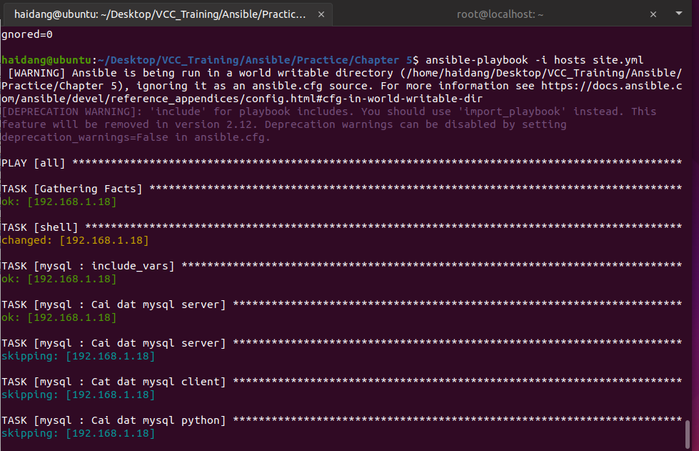
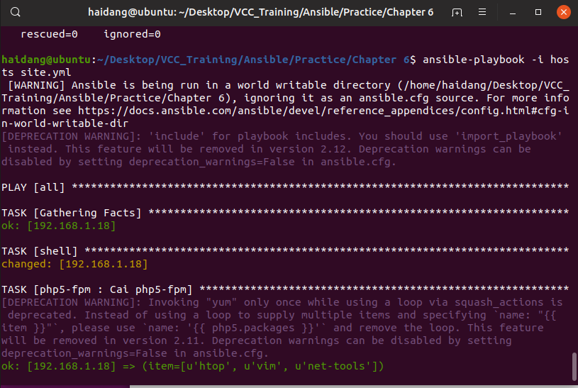

# Practice

# Dùng Ansible cài basic chỉ dùng 1 file task.
  

# Dùng Ansible cài nginx server dùng roles
  

# Dùng Ansible cài nginx server dùng roles ( có dùng thêm var, handler tách riêng ) và cài cơ bản wordpress
  
  

# Cài mysql và các gói liên quan, setting ( có dùng điều kiện, vòng lặp )
  
  

# Các lỗi gặp phải và cách khắc phục

### yum lockfile is held by another process  
 Restart lại các máy agent   

### sudo: a password is required   
 Thêm become: false   

### with_items: "{{ php5.package }}"
Trong cuốn sách ghi sai dòng code này là ` with_items:  php5.package ` nên sẽ không cài được, phải sửa như trên

### No package matching 'php5' found available, installed or updated.
Phải dùng cả 2 cách sửa:  
- 1 là do package đấy không còn nữa
- 2 là phải thêm update_cache: yes

    

