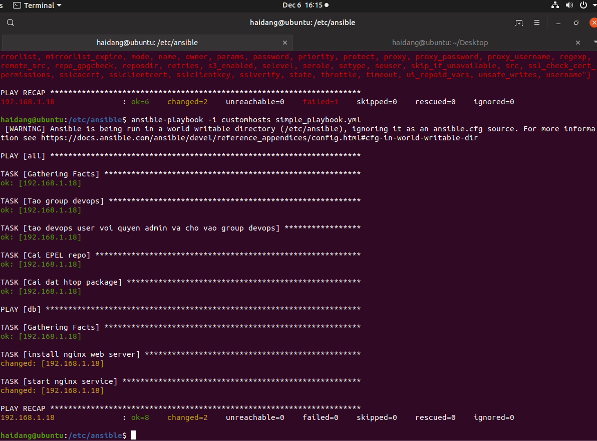
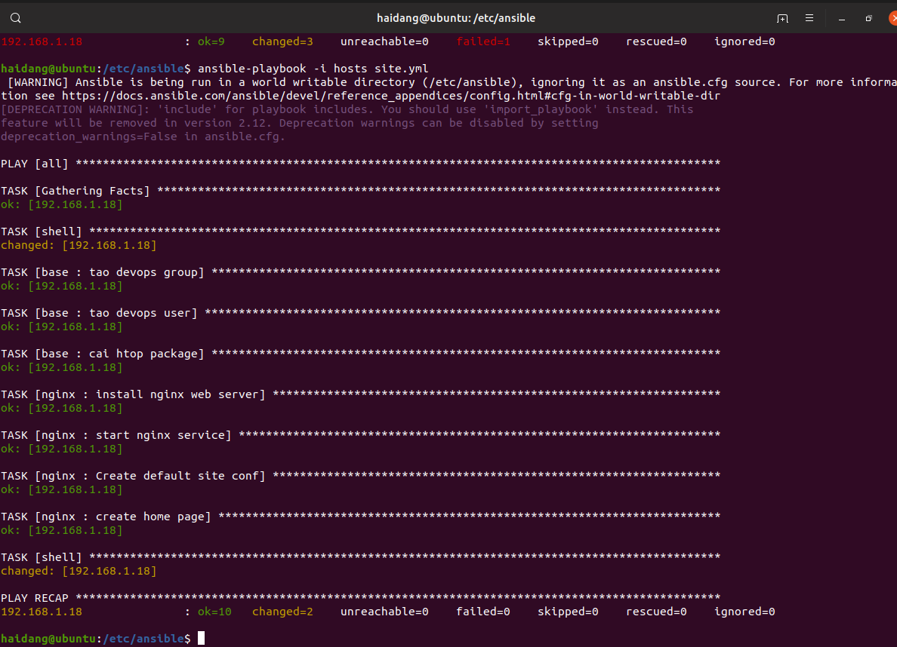

# Practice

# Dùng Ansible cài basic chỉ dùng 1 file task.
  

# Dùng Ansible cài nginx server dùng roles
  

# Dùng Ansible cài nginx server dùng roles ( có dùng thêm var, handler tách riêng ) và cài cơ bản wordpress
  
  

# Các lỗi gặp phải và cách khắc phục

### yum lockfile is held by another process  
### Restart lại các máy agent   

### sudo: a password is required   
### Thêm become: false   

