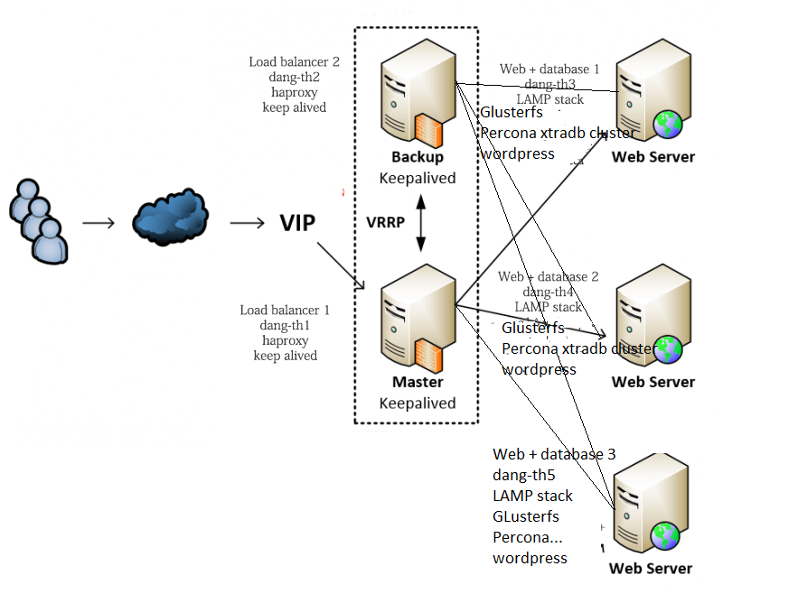

# HA deploy Ver. 1
  

**LƯU Ý: PLAYBOOK NÀY CHỈ ÁP DỤNG MÔ HÌNH TRÊN**  

## Hướng dẫn sử dụng
### Folder load_balancer

Vào trong này chỉnh sửa các thông số.  

** Một số thông số cần lưu ý :**

```
name_1: Tên web server 1
name_2: Tên web server 2
ip_1: IP web server 1
ip_2: IP web server 2
```  

### Folder Sync_db 

**Chỉnh sửa ở cả 4 folder**  

```
database replica: Tài khoản để replication
database root: tài khoản root
wordpress database: Lưu ý phải giống ở folder wordpress
```  

### Folder Sync_web

**Chỉnh sửa ở cả 2 folder và tất cả thông số là ở bên server còn lại**

```
root password: của server còn lại
ip: của server còn lại
```  


# Một số lỗi
Note:

- lỗi replica hay bị lỗi query thì đồng bộ: phải thêm bin_log_dodb  
- load balancer ko truy cập được: bỏ option: forwardfor  
- file config của mysql nằm ở /etc/mysql/mysqld....  
- để remote mysql cần phải bỏ option bind-address  
- phải thêm option cookie session ở load balancer thì mới ko bị lệch phiên.


# Tài liệu tham khảo
[https://www.digitalocean.com/community/tutorials/how-to-use-haproxy-to-set-up-http-load-balancing-on-an-ubuntu-vps](https://www.digitalocean.com/community/tutorials/how-to-use-haproxy-to-set-up-http-load-balancing-on-an-ubuntu-vps)

[https://www.linode.com/docs/uptime/loadbalancing/how-to-use-haproxy-for-load-balancing/](https://www.linode.com/docs/uptime/loadbalancing/how-to-use-haproxy-for-load-balancing/)

Loi khong dong bo DB
https://dba.stackexchange.com/questions/34940/adding-a-user-to-mysql-with-name-fails-with-error-1396

check: https://stackoverflow.com/questions/27606119/make-ansible-check-if-database-is-present-on-a-remote-host

HA deploy  
  
[https://www.digitalocean.com/community/tutorials/how-to-use-haproxy-to-set-up-http-load-balancing-on-an-ubuntu-vps](https://www.digitalocean.com/community/tutorials/how-to-use-haproxy-to-set-up-http-load-balancing-on-an-ubuntu-vps)  
  
master master db:  
[http://chichio.com/vi/thanks/c%E1%BA%A5u-h%C3%ACnh-mysql-master-master-replication](http://chichio.com/vi/thanks/c%E1%BA%A5u-h%C3%ACnh-mysql-master-master-replication)  
[https://www.linode.com/docs/databases/mysql/configure-master-master-mysql-database-replication/](https://www.linode.com/docs/databases/mysql/configure-master-master-mysql-database-replication/)  
  
remove:  
[https://oofloo.com/uninstall-mysql-ubuntu/](https://oofloo.com/uninstall-mysql-ubuntu/)  
  
ansible replica  
[https://github.com/VitaliiMichailovich/Ansible-MySQL-Master-Master/blob/master/4.yml](https://github.com/VitaliiMichailovich/Ansible-MySQL-Master-Master/blob/master/4.yml)  
[https://topic.alibabacloud.com/a/managing-mysql-replication-with-ansible_1_41_30026734.html](https://topic.alibabacloud.com/a/managing-mysql-replication-with-ansible_1_41_30026734.html)  
[https://docs.ansible.com/ansible/latest/modules/mysql_replication_module.html](https://docs.ansible.com/ansible/latest/modules/mysql_replication_module.html)  
[https://github.com/ekeih/setup-mysql-slave](https://github.com/ekeih/setup-mysql-slave)
