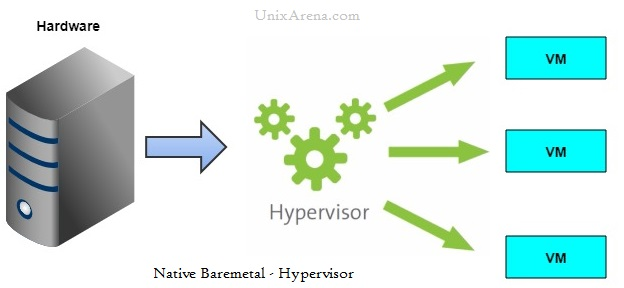
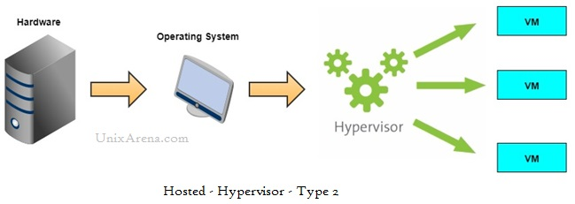
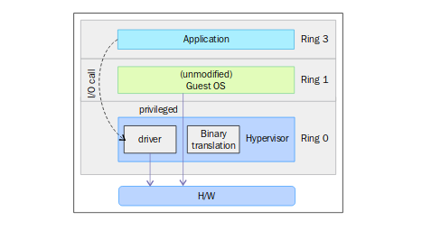
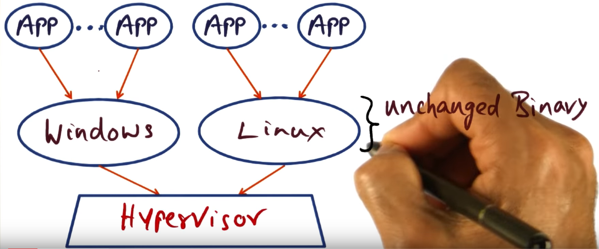
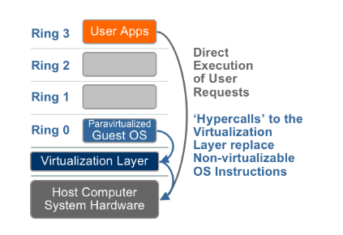
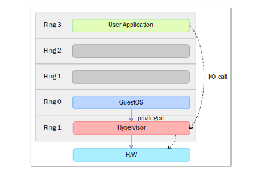
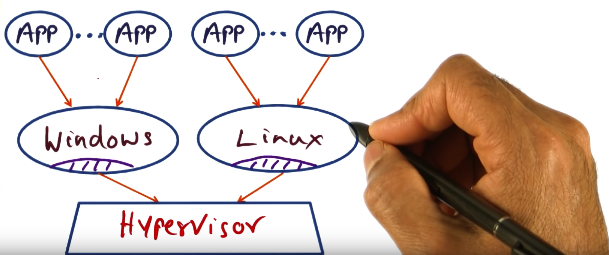
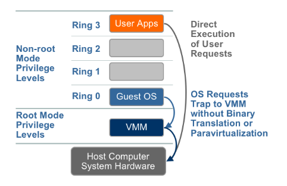
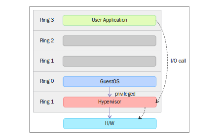

# Tổng quan về Virtualization và Hypervisor

## Virtualization là gì? 

`Virtualization`, hay còn gọi là ảo hóa, là một công nghệ được thiết kế để tạo ra tầng trung gian giữa hệ thống phần cứng máy tính và phần mềm chạy trên nó. Ý tưởng của công nghệ ảo hóa máy chủ là từ một máy vật lý đơn lẻ có thể tạo thành nhiều máy ảo độc lập. Mỗi một máy ảo đều có một thiết lập nguồn hệ thống riêng rẽ, hệ điều hành riêng và các ứng dụng riêng. Ảo hóa có nguồn gốc từ việc phân chia ổ đĩa, chúng phân chia một máy chủ thực thành nhiều máy chủ logic. Một khi máy chủ thực được chia, mỗi máy chủ logic có thể chạy một hệ điều hành và các ứng dụng độc lập.

***--> Tóm lại, ảo hóa là phương pháp để tạo ra phiên bản ảo hóa trên máy tính vật lý.***

## Tại sao nên sử dụng công nghệ ảo hóa?

Tiết kiệm chi phí và tối ưu hóa hạ tầng CNTT là điều mà các doanh nghiệp quan tâm, đặc biệt là các doanh nghiệp có nhiều chi nhánh trong cả nước hay trên toàn cầu. Ảo hóa giúp doanh nghiệp nâng cao năng lực bảo mật dữ liệu, tăng cường khả năng khôi phục hoạt động sau thảm họa, nâng cao tính linh hoạt và cắt giảm chi phí đầu tư cho CNTT như phải cập nhật liên tục các phần mềm, các tính năng mới… trên nhiều máy tính vật lý.

## Virtual Machine là gì? 

`Virtual Machine` hay còn gọi là máy ảo, là một môi trường hoạt động độc lập – phần mềm hoạt động cùng nhưng độc lập với hệ điều hành máy chủ.

## Hypervisor/VMM là gì ?

`Hypervisor` hay còn gọi là phần mềm giám sát máy ảo: Là một chương trình phần mềm quản lý một hoặc nhiều máy ảo (VM). Nó được sử dụng để tạo, startup, dừng và reset lại các máy ảo. Các hypervisor cho phép mỗi VM hoặc “guest” truy cập vào lớp tài nguyên phần cứng vật lý bên dưới, chẳng hạn như CPU, RAM và lưu trữ. Nó cũng có thể giới hạn số lượng tài nguyên hệ thống mà mỗi máy ảo có thể sử dụng để đảm bảo cho nhiều máy ảo cùng sử dụng đồng thời trên một hệ thống.

***-->Tóm lại, hypervisor là các phần mềm công nghệ để tạo máy ảo và giám sát, điều khiển máy ảo***

Có 2 loại hypervisor là `Native` ( hay còn gọi là `Bare metal` ) và `Host Based`

### Loại-1: Native

Một hypervisor ở dạng native (hay còn gọi “bare-metal”) chạy trực tiếp trên phần cứng. Nó nằm giữa phần cứng và một hoặc nhiều hệ điều hành khách (guest operating system). Nó được khởi động trước cả hệ điều hành và tương tác trực tiếp với kernel. Điều này mang lại hiệu suất cao nhất có thể vì không có hệ điều hành chính nào cạnh tranh tài nguyên máy tính với nó. Tuy nhiên, nó cũng đồng nghĩa với việc hệ thống chỉ có thể được sử dụng để chạy các máy ảo vì hypervisor luôn phải chạy ngầm bên dưới. 

Các hypervisor dạng native này có thể kể đến như VMware ESXi, Microsoft Hyper-V và Apple Boot Camp.

### Loại-2: Hosted

Một hypervisor dạng hosted được cài đặt trên một máy tính chủ (host computer), mà trong đó có một hệ điều hành đã được cài đặt. Nó chạy như một ứng dụng cũng như các phần mềm khác trên máy tính. Hầu hết các hypervisor dạng hosted có thể quản lý và chạy nhiều máy ảo cùng một lúc. Lợi thế của một hypervisor dạng hosted là nó có thể được bật lên hoặc thoát ra khi cần thiết, giải phóng tài nguyên cho máy chủ. Tuy nhiên, vì chạy bên trên một hệ điều hành, nó có thể đem lại hiệu suất tương tự như một hypervisor ở dạng native.

Ví dụ về các hypervisor dạng hosted bao gồm VMware Workstation, Oracle VirtualBox và Parallels Desktop for Mac.

## Ring

Trong khoa học máy tính, Hierarchical Protection Domains (hay Protection Rings) là cơ chế nhằm bảo vệ dữ liệu và chức năng của một chương trình tránh khỏi nguy cơ lỗi hoặc bị truy cập trái phép bởi các chương trình khác.

Một Protection Ring là một mức độ (mode/level/layer) truy cập tài nguyên hệ thống. Số lượng Ring tùy thuộc vào kiến trúc CPU và hệ điều hành chạy trên kiến trúc đó có khả năng hỗ trợ bao nhiêu Ring.

Các Ring được sắp xếp có thứ bậc, từ mức có nhiều đặc quyền nhất (dành cho trusted-software, thường được đánh số 0) đến mức có ít đặc quyền nhất (dành cho untrusted-software, được đánh số cao nhất).

Dưới đây là hình minh họa các Ring trong kiến trúc CPU x86

Các chương trình hoạt động tại Ring 0 có đặc quyền cao nhất, có thể tương tác trực tiếp với phần cứng như CPU, Memory…

Để cho phép các ứng dụng nằm ở Ring có trọng số cao truy cập các tài nguyên được quản lý bởi các chương trình nằm ở Ring có trọng số thấp hơn, người ta xây dựng các cổng (gate) đặc biệt. Ví dụ như system call (lời gọi hàm hệ thống) giữa các Ring.

Việc quy định chặt chẽ chương trình nào nằm tại Ring nào cộng với việc xây dựng các cổng phù hợp giữa các Ring sẽ đảm bảo tính ổn định của hệ thống, đồng thời ngăn chặn các chương trình nằm trong Ring cao sử dụng trái phép (do vô tình hoặc cố ý) các tài nguyên dành cho các chương trình khác nằm tại Ring thấp hơn

Ví dụ, một spyware đang chạy với tư cách là ứng dụng cho người dùng thông thường (thuộc untrusted software) nằm tại Ring 3 có ý định bật webcam mà không được sự đồng ý của người dùng. Hành vi này sẽ bị hệ thống ngăn chặn vì muốn truy cập tới phần cứng là thiết bị webcam nó phải sử dụng một hàm trong phần mềm điều khiển thiết bị (device driver) của webcam (thuộc trusted software) nằm tại Ring 1.

Hầu hết các hệ điều hành chỉ sử dụng 2 Ring ngay cả khi phần cứng mà hệ điều hành chạy trên đó hỗ trợ nhiều hơn 2 Ring. Ví dụ, Windows chỉ sử dụng 2 mức là Ring 0 (tương ứng với Kernel Mode) và Ring 3 (tương ứng với User Mode).

***--> Tóm lại, `ring` cách ly người dùng với hệ điều hành bằng các cấp đặc quyền.***

## Phân loại Virtualization

Trong ảo hóa, người ta có thể ảo hóa:

- RAM virtualization

- CPU virtualization

- Network virtualization

- Device I/O virtualization

Trong khuôn khổ bài viết, tôi sẽ chỉ tập trung đến `CPU virtualization`.

# CPU virtualization

Có 4 loại CPU virtualization :

- Full Virtualization

- Paravirtualization

- Container-based Virtualization

- Hardware Assisted Virtualization

- OS level Virtualization

- Hybrid Virtualization: ( Hardware Virtualized with PV Drivers )

Trong khuôn khổ bài viết, tôi sẽ tập trung vào `Full Virtualization` và `Paravirtualization`

## Full Virtualization

Trong giải pháp này, các non-virtualizable instruction từ guest OS được translate qua binary translation ở virtualization layer và cache lại kết quả dùng cho các lần sau. Còn user level application thì thực hiện direct execution xuyên qua virtualization layer. Bằng cách này, trở ngại các chỉ thị guest OS không hoạt động ở ring khác 0 bị vượt qua còn các user level application vẫn họat động ở native speed (tốc độ đáp ứng yêu cầu giống như khi không có ảo hóa). Guest OS hoàn toàn không nhận ra nó đang nằm trên một lớp ảo hóa vì các low-level request không có gì thay đổi. Do đó guestOS hoàn toàn không phải chỉnh sửa gì.

***Hiểu dân dã***: thằng Guest OS nó sẽ không bị sửa đổi hệ điều hành để tương thích với phần cứng, mà nó sẽ dịch nhị phân các yêu cầu, rồi đưa cho thằng VMM, xong thằng VMM làm trung gian đưa cho thằng Hardware xử lý.

Nhìn vào `ring` = 1 của nó, thì thằng Guest OS này chỉ chạy trên quyền `user lever`, chứ không chạy trên quyền `privilege`, nó không trực tiếp chạy trên thằng hardware. Nhưng vì code của OS không bị sửa đổi, nên thằng Guest OS nó không biết điều đó, và nó làm việc bình thường như trên máy thật vậy, nhưng thực chất nó đang làm việc với thằng VMM.

## Paravirtualization

Trong paravirtualization, hypervisor sẽ cung cấp hypercall interface. Guest OS sẽ được chỉnh sửa kernel code để thay thế non-virtualizable instruction bằng các hypercall này. Do kernel code của guest OS phải chỉnh sửa nên giải pháp này không thể sử dụng được một số hệ điều hành mã nguồn đóng như windows. Thêm nữa, do guest OS sử dụng hypercall nên nó sẽ biết được nó đang nằm trên một virtualization layer.

***Hiểu dân dã***: 
thằng Guest OS bây giờ đã bị sửa đổi 1 tí, để có thể nằm ở `ring` o, Việt Nam gọi là nhập gia tùy tục. Thằng Guest OS nó hiểu vị trí của mình chỉ là thằng khách thôi, nhưng mà nó lại có thể nhìn trực tiếp tài nguyên của máy thật, quyền truy cập vào hardware vì nó nằm ở `ring` 0. 

Nhưng đối với các App, nó vẫn thấy thằng Guest OS này không có gì thay đổi, vì App cần interface gì thì Guest OS nó vẫn cung cấp cho interface ý, vẫn là API ý.    

## Hardware Assisted Virtualization - thêm

Các giải pháp hỗ trợ ảo hóa của hardware vendor được công bố vào năm 2006 như VT-x của Intel hay AMD-v của AMD. Cả hai giải pháp này đều hướng đến việc xây dựng một CPU mode mới dành riêng cho virtualization layer gọi là root mode ( CPU mode -1). Bằng cách này, các OS request từ guest OS sẽ được tự động đi xuyên qua virtualization layer và cũng không cần kỹ thuật binary translation nữa do guest OS đã nằm ở ring 0. Trạng thái của guest OS sẽ được lưu trong Virtual machine control structure (VT-x) hoặc Virtual machine control block (AMD-v). Tuy rất hứa hẹn nhưng giải pháp này chưa tối ưu về code nên ứng dụng còn hạn chế. Hiện tại VMWare chỉ tận dụng hardware virtualization cho 64 bits guest OS.

***Hiểu dân dã***: Đây chính là sự kết hợp của bố `Full Virtualization` và mẹ `Paravirtualization`, có tất cả ưu điểm của cả hai bố mẹ, vừa không bị sửa đổi OS, tương thích với phần cứng mà vẫn được chạy ở `ring 0`

## OS Virtualization 

- Một hệ điều hành được vận hành ngay trên một hệ điều hành chủ đã tồn tại và có khả năng cung cấp một tập hợp các thư viện tương tác với các ứng dụng, khiến cho mỗi ứng dụng truy xuất tài nguyên phần cứng cảm thấy như truy xuất trực tiếp máy chủ vật lý.  
- Đây là cái chúng ta hay thấy nhất. Ta có thể tạo ra nhiều máy ảo trên một chiếc máy tính duy nhất và đặc biệt là có thể chạy song song cùng lúc 2 hệ điều hành. Có thể là Mac chạy song song Windows, Win XP và Win 7, Win 7 và Win 8, Windows và Linux… Việc chuyển đổi qua lại giữa 2 hệ điều hành cũng đơn giản giống như chuyển qua lại giữa 2 cửa sổ trên máy tính, bạn cũng có thể chia sẻ dữ liệu giữa máy thực và máy ảo với nhau hoàn toàn dễ dàng. Để tạo máy ảo, ta cần có một phần mềm chuyên dụng. Có rất nhiều phần mềm giúp ta tạo máy ảo, ví dụ như trên Win thì có VMware, VirtualBox, Virtual PC… Trên Mac thì cũng có VMware Fusion và Parallels. Cách cài đặt cũng rất đơn giản, ví dụ như VMware, bạn chỉ việc cài VMware vào máy tính, tải file ảnh của hệ điều hành thứ hai về, sau đó làm theo hướng dẫn trong đó là OK. Do nó cũng là một hệ điều hành (gần như hoàn chỉnh) nên máy ảo cũng cần có CPU, RAM, ổ cứng cũng như các linh kiện phần cứng có liên quan. Ở đây máy ảo sẽ dùng chung các phần cứng đó với máy tính của bạn. Nghĩa là giờ đây thay vì chỉ chạy một hệ điều hành thì máy tính của bạn phải gồng mình lên để chạy đến 2 cái hệ điều hành cùng lúc, lúc đó máy sẽ chạy ì ạch hơn. Vì vậy nếu cấu hình máy của bạn quá yếu thì không nên dùng máy ảo quá nhiều. Thường khi tạo thêm máy ảo thì nó sẽ cắt ra khoảng vài GB RAM dùng cho máy ảo đó, CPU dùng chung và ổ cứng cũng phải chia ra thêm một khoảng kha khá để chứa hệ điều hành thứ 2 này.  
- Các phần mềm hỗ trợ: OpenVZ, Linux-VServer, Docker,...

## Partial virtualization : Ảo hóa cục bộ ( một phần)

- Khác với ảo hóa toàn phần, ảo hóa một phần chỉ tiến hành ảo hóa một số phần cứng nhất định của máy tính nên nó không đủ tài nguyên để vận hành một hệ điều hành ảo hoàn chỉnh, thay vào đó nó chỉ cho phép chúng ta chạy một số phần mềm mà thôi. Ưu điểm của áo hóa một phần là nó dễ triển khai hơn ảo hóa toàn phần, nó tỏ ra cực kỳ hữu ích khi người ta chỉ muốn dùng máy ảo để chạy một phần mềm quan trọng nào đó, họ sẽ dùng ảo hóa một phần để tạo ra đủ tài nguyên cần thiết để chạy nó mà không cần phải ảo hóa cả một hệ thống phức tạp. Nếu dùng ảo hóa toàn phần chỉ để chạy một phần mềm duy nhất thì coi như là ta đã lãng phí tài nguyên máy tính một cách vô ích.

# Nguồn tham khảo :

https://quantrimang.com/ao-hoa-la-gi-tai-sao-ban-nen-su-dung-cong-nghe-nay-157936

https://www.thegioimaychu.vn/blog/thuat-ngu/hypervisor/

https://manthang.wordpress.com/2010/10/30/co-che-protection-rings-trong-bao-mat-may-tinh/

https://www.unixarena.com/2017/12/para-virtualization-full-virtualization-hardware-assisted-virtualization.html/

https://trello-attachments.s3.amazonaws.com/5bdfeef5e32af505bfa1082e/5c1746250dd5af4780593f86/1ddf3d7e284667df4b317efc6a840b3f/Mastering_KVM_Virtualization.pdf

https://www.vmware.com/content/dam/digitalmarketing/vmware/en/pdf/techpaper/VMware_paravirtualization.pdf

https://www.youtube.com/watch?v=1PYNcmZTjiE

https://www.youtube.com/watch?v=CLR0pq9dy4g

https://www.unixarena.com/2017/12/para-virtualization-full-virtualization-hardware-assisted-virtualization.html/

http://coffeecode101.blogspot.com/2016/01/virtualization.html

https://viblo.asia/p/tan-man-ao-hoa-ai-cung-biet-nhung-cu-the-no-la-gi-Do754NV3ZM6

