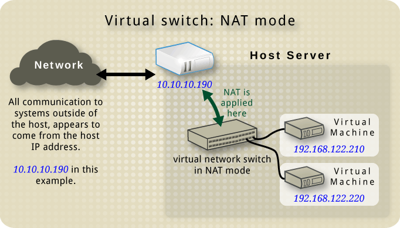
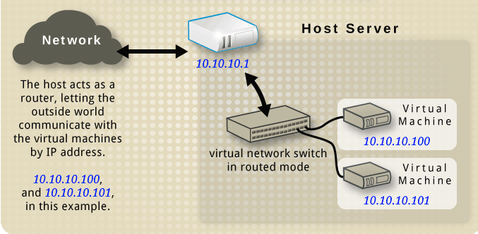
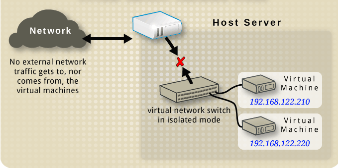

- [I. NAT](#a)
- [II. Linux Bridge](#b)
- [III. Open VSwitch Bridge](#c)
- [ IV. Host Only](#d)


<a name="a"></a>
# I. NAT
  

Với mô hình này KVM thực hiện ánh xạ một dải địa chỉ để cung cấp cho máy ảo. Dải địa chỉ ta có thể chọn tùy ý. Với mô hình này máy ảo của ta có thể giao tiếp với internet. Nhưng có một chú rằng từ VM của ta có thể ping được ra ngoài internet nhưng máy bên ngoài sẽ không thấy được VM của ta chính vì vậy ta không thể ping từ bên ngoài đến VM sử dụng mô hình mạng NAT.

## Cách cấu hình

1. Hiện danh sách các mạng
```
root@kvm:~# virsh net-list --all  

```  

2.  Đảm bảo rằng KVM instance có kết nối đến default linux bridge
```
root@kvm:~# brctl show  

bridge name  
virbr0

bridge id  
8000.fe5400559bd6

STP enabled interfaces  
yes vnet0
```  

3. Tạo file XML ghi thông số của NAT
```
root@kvm:~# cat nat_net.xml  
<network>  
<name>nat_net</name>  
<bridge name="virbr1"/>  
<forward/>  
<ip address="10.10.10.1" netmask="255.255.255.0">  
<dhcp>  
<range start="10.10.10.2" end="10.10.10.254"/>  
</dhcp>  
</ip>  
</network>
```  

4. Define NAT
```
root@kvm:~# virsh net-define nat_net.xml  
Network nat_net defined from nat_net.xml
```  

5. Bật NAT lên và bật tính năng auto start
```
root@kvm:~# virsh net-start nat_net  
Network nat_net started  

root@kvm:~# virsh net-autostart nat_net  
Network nat_net marked as autostarted
```  

6. Edit file XML của KVM instance

```
root@kvm:~# virsh edit kvm1  
...  
<interface type='network'>  
...  
<source network='nat_net'/>  
...  
</interface>  
...  
Domain kvm1 XML configuration edited.
```  
<a name="b"></a>
# II. Linux Bridge

Linux bridge là một phần mềm được tích hợp trong nhân linux để giải quyết vấn đề ảo hóa phần Network trong trong các máy vật lý. Về mặt logic Linux bridge tạo ra một con switch ảo để các VM kết nối vào và có thể nói chuyện được với nhau cũng như sử dụng để ra ngoài mạng.

  

Với mô hình mạng này ta có thể dùng dải mạng tương ứng với mỗi card mạng của ta. Ta cũng có thể add thêm 1 còn switch ảo và gán cho nó các card mạng tương ứng. Lúc này khi các VM kết nối vào switch đó nó sẽ nhận địa chỉ của card đã kết nối với switch.

## Tổng hợp 1 số lệnh

-   Tạo bridge  `brctl addbr tên_bridge`
-  Xoá bridge  `brctl delbr tên_bridge`
-   Gán port cho bridge  `brctl addif tên_bridge tên_card`
-   Kiểm tra lại hoạt động của bridge  `brctl show`
-   Ngắt card khỏi bridge  `brctl delif tên_bridge tên_card`  _Lưu ý_  Với các card mạng có sẵn trên máy hoặc các card được sinh ra trong quá trình cài các phần mềm ảo hóa thì mặc định nó đã được gắn với một switch ảo có cùng tên nên vì vậy muốn kết nối bridge đến các switch đó ta chỉ cần kết nối các máy VM đến nó là được.

## Cấu hình Linux Bridge
1. Install package
```
root@kvm:~# apt install bridge-utils
```  

2.  Tạo Bridge
```
root@kvm:~# brctl addbr virbr0  
root@kvm:~# brctl show  
bridge name bridge id STP enabled interfaces  
virbr0 8000.000000000000 no  
root@kvm:~# ifconfig virbr0 up

```  

* NOTE: Không tạo trùng tên virtual bridge với cái đã có sẵn rồi. Nếu muốn tạo trùng thì delete cái cũ đi.

3. Gán IP address cho bridge
```
root@kvm:~# ip addr add 192.168.122.1 dev virbr0
```  

4. Gán interface máy ảo vào bridge
```
root@kvm:~# brctl addif virbr0 vnet0
```  

5. Mở giao thức STP
```
root@kvm:~# brctl stp virbr0 on  
root@kvm:~# brctl showstp virbr0
```  

6. Vào trong KVM Instance, khởi động card mạng
```
root@debian:~# ifconfig eth0 up  
root@debian:~# dhclient eth0
```  
<a name="c"></a>
# III. Open VSwitch Bridge
- Open vSwitch là một soft-switch, một trong ba công nghệ cung cấp switch ảo trong hệ thống Linux (bên cạnh macvlan và Linux bridge), giải quyết vấn đề ảo hóa network bên trong các máy vật lý.  
- Open vSwitch là phần mềm mã nguồn mở , giấy phép của Apache2.  
- Openvswitch hỗ trợ nhiều công nghệ ảo hóa trên Linux bao gồm Xen/XenServer, KVM, and VirtualBox.  
- Mã nguồn chủ yếu được viết bằng C, độc lập với các nền tảng và dễ dàng di chuyển giữa các môi trường.

`- Với libvirt API, Open vSwitch chỉ có chế bridge, không có 3 chế độ NAT, Routed, Isolated như đối với linux brdige.`

## Cấu hình Open Vswitch
**LƯU Ý: Phải REMOVE TẤT CẢ LINUX BRIDGE**

1. Cài Open Vswitch
```
root@kvm:~# apt-get install openvswitch-switch
```  
2. Lệnh hiển thị list switch hiện có
```
root@kvm:~# ovs-vsctl show  
e5164e3e-7897-4717-b766-eae1918077b0  
ovs_version: "2.0.2
```  

3. Tạo switch mới
```
root@kvm:~# ovs-vsctl add-br virbr1  
root@kvm:~# ovs-vsctl show  
e5164e3e-7897-4717-b766-eae1918077b0  
Bridge "virbr1"  
Port "virbr1"  
Interface "virbr1"  
type: internal  
ovs_version: "2.0.2"
```  

4.  Add interface của kvm vào switch
```
root@kvm:~# ovs-vsctl add-port virbr1 vnet0  
root@kvm:~# ovs-vsctl show  
e5164e3e-7897-4717-b766-eae1918077b0  
Bridge "virbr1"  
Port "virbr1"  
Interface "virbr1"  
type: internal  
Port "vnet0"  
Interface "vnet0"  
ovs_version: "2.0.2"
```  

5. Thiết lập địa chỉ IP cho switch
```
root@kvm:~# ip addr add 192.168.122.1/24 dev virbr1
```  

6. Ở trong KVM Instance, thiết lập IP tĩnh
```
ifconfig eth0 up && ip addr add 192.168.122.210/24 dev  
eth0
```  
<a name="d"></a>
# IV. Host Only
Với mô hình mạng kiểu này cũng cho phép ta cấp phát địa chỉ tùy ý giống với mô hình NAT. Nhưng ở đây máy ảo không thể nói chuyện với máy tính bên ngoài. Nó chỉ có thể trao đổi với các máy trong cùng mạng bên trong server vật lý và trao đổi với đươc máy chủ vật lý.

  


