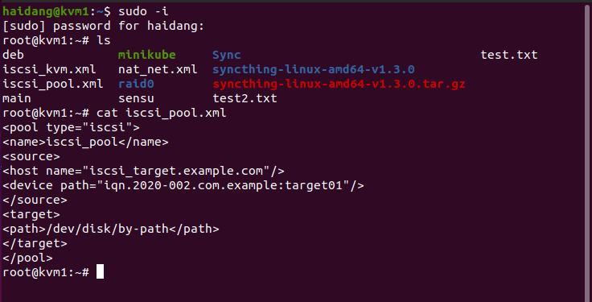
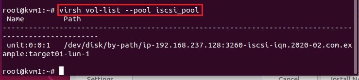
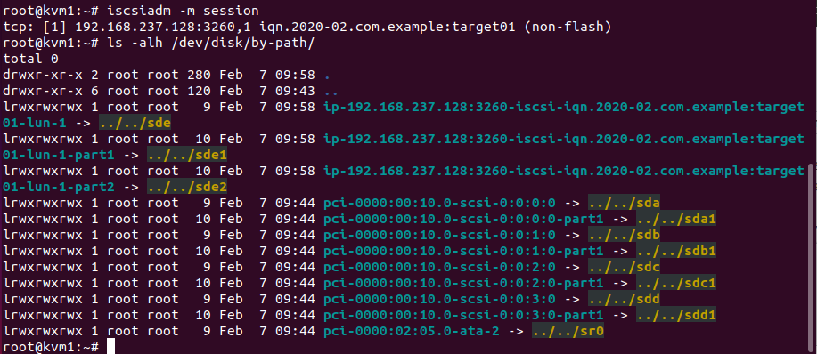

- [Giới thiệu ](#a)
- [I. Offline migrating using an iSCSI storage pool](#b)
- [II. Offline migrating using GlusterFS](#c)
- [III. Online migration using the virsh command with shared storage](#d)
- [IV. Offline migration using the virsh command and local image](#e)
- [V. Online migration using the virsh command and local image](#f)


<a name="a"></a>
# Giới thiệu  

Di chuyển KVM Instance là quá trình gửi các tình trạng, trạng thái của ram, cpu, thiết bị ảo gắn liền với nó đến một server khác. Hiểu đơn giản hơn thì là di chuyển toàn bộ thư mục, các file image, các volume, storage pool, hạ tầng mạng, block device của các máy ảo đến một server mới. Có hai loại migrate là:
-  Offline migration: Chúng ta sẽ down toàn bộ các máy ảo. rồi thực hiện việc di chuyển toàn bộ image của guest VM đến hypervisor đích. Rồi sau đó sẽ lại khởi động guest VM để tiếp tục làm việc.
- Live migration: Chúng ta sẽ di dời các instance ở tình trạng hiện tại đi mà không cần down bất cứ thứ gì. Cái này đảm bảo tính sẵn sàng.

## Các bước để offline migration:
1. Stop instance lại
2. Dump file XML của instance ra
3. Copy guest filesystem image sang server mới ( nếu không dùng shared storage)
4. Define instance rồi start lên.

## Các bước để Live migration:
1. Máy instance vẫn chạy bình thường trong khi memory được chuyển đến host mới.
2. Libvirt sẽ giám sát thay đổi trong memory và nếu có gì mới thì sẽ truyền lại.
3. Khi memory content đã được chuyển đến host mới, instance cũ sẽ dừng và instance mới sẽ được bật lên.


<a name="b"></a>
# I. Offline migrating using an iSCSI storage pool
## Chuẩn bị
- 2 server có cài libvirt và qemu tên là kvm1 và kvm2. 2 server có thể ssh được với nhau.
- 1 server iSCSI làm shared storage.

- ***Có thể hiểu nôm na cách này là dùng 1 cái ổ cứng ở trên storage server (disk). Chúng ta chỉ việc migrate file xml kvm ( chứa thông tin kvm ) và cấu hình storage pool đi.***

## Các bước cấu hình trên server iSCSI
1. Install TGT
```
apt -y install tgt
```  

2. Tạo 1 block device để chứa volume
```
dd if=/dev/zero of=/var/lib/iscsi_disks/disk01.img count=0 bs=1 seek=10G
```  
3. Tạo file trong /etc/tgt/conf.d chứa thông số
```
cat /etc/tgt/conf.d/target01.conf
```  

**nội dung file thực tế:**
```
<target iqn.2020-02.com.example:target01>
	backing-store /var/lib/iscsi_target/disk01.img
</target>
```  

ví dụ để tham khảo:
```
# create new
# naming rule : [ iqn.(year)-(month).(reverse of domain name):(any name you like) ]
<target iqn.2018-05.world.srv:dlp.target01>
    # provided devicce as a iSCSI target
    backing-store /var/lib/iscsi_disks/disk01.img
    # iSCSI Initiator's IQN you allow to connect to this Target
    initiator-name iqn.2018-05.world.srv:www.initiator01
    # authentication info ( set any name you like for "username", "password" )
    incominguser username password
</target>
```  

4. restart tgt
```
systemctl restart tgt
```  
5.  Xem thông số
```
tgtadm --mode target --op show
```  

## Các bước cấu hình trên kvm1 và kvm2
1. install các gói cần thiết
```
root@kvm1/2:~# apt-get update && apt-get install open-iscsi
```  
2. Tìm các iscsi volume có sẵn
```
root@kvm1/2:~# iscsiadm -m discovery -t sendtargets -p [ip]
```  
* NOTE: Chỗ 'ip' thay bằng IP của server iscsi hoặc domain name nếu có.
3.  trên kvm1, tạo storage pool:
  

* NOTE : Chỗ device path nhớ để đúng tên mà config trên server iscsi, còn lại tuỳ chọn.

4. Khởi động iscsi pool
```
root@kvm1:~# virsh pool-start iscsi_pool  
Pool iscsi_pool started
```  
5. Xem danh sách vol list trong iscsi pool
  

6. Hiển thị iscsi session
  

7. Cài KVM guest dùng volume và pool
```
 virt-install --name iscsi_kvm --ram 1024 --disk vol=iscsi_pool/unit:0:0:1 --vcpus 2 --os-type linux --network bridge=virbr0 --graphics vnc,listen=192.168.1.75 --cdrom=/home/haidang/Desktop/a/ubuntu-18.04.3-live-server-amd64.iso
```  

**LƯU Ý: Chỗ Unit:0:0:1 thay đổi tuỳ vào máy, lúc xem vol list nó ghi bao nhiêu thì chỗ này chọn như thế ( không phải lúc nào cũng là 0:0:0 như mặc định hướng dẫn )**


8. Khởi động KVM
```
root@kvm1:~# virsh start iscsi_kvm  
Domain iscsi_kvm started
```  

## Migrate sang kvm2
1. Dừng toàn bộ instance và pool
```
root@kvm1:~# virsh destroy iscsi_kvm  
Domain iscsi_kvm destroyed  
root@kvm1:~# virsh pool-destroy iscsi_pool  
Pool iscsi_pool destroyed  
root@kvm1:~# iscsiadm -m session  
iscsiadm: No active sessions.
```  

2. Dump XML của instance ra
```
root@kvm1:~# virsh dumpxml iscsi_kvm > iscsi_kvm.xml
```  

3. Tạo iscsi pool trên kvm 2 từ xa
```
root@kvm1:~# virsh --connect qemu+ssh://kvm2/system pool-define  
iscsi_pool.xml  
Pool iscsi_pool defined from iscsi_pool.xml
```  

* NOTE: Chỗ kvm2 có thể thay thế bằng IP nếu không có domain name (sửa domain name trong /etc/hosts)
* NOTE 2: Nhớ dùng lệnh trên để SSH từ kvm1 sang kvm2 để tạo storage pool, đừng tạo thủ công trên kvm2.
* NOTE 3: Trên kvm2 config ssh mở password authentication và root login permit thì mới ssh với quyền root qua được.

4. start pool trên kvm 2
```
root@kvm1:~# virsh --connect qemu+ssh://kvm2/system pool-start iscsi_pool
```  

* Note: Start thủ công trên kvm2 cũng được

5.  Check vol list xem đã tạo thành công chưa
```
root@kvm1:~# virsh --connect qemu+ssh://kvm2/system vol-list --pool iscsi_pool
```  
```
root@kvm2:~# iscsiadm -m session  
```  

6.  Chuyển file XML của KVM instance sang kvm2
```
root@kvm1:~# virsh --connect qemu+ssh://kvm2/system define iscsi_kvm.xml  
Domain iscsi_kvm defined from iscsi_kvm.xml
```  

7. Khởi động kvm instance
```
root@kvm1:~# virsh --connect qemu+ssh://kvm2/system start iscsi_kvm  
Domain iscsi_kvm started
```  
<a name="c"></a>
# II. Offline migrating using GlusterFS
## Chuẩn bị
- 2 server chạy GlusterFS (2 server để replica với nhau)
- 2 server kvm1 và kvm2 chạy libvirt và qemu
- GlusterFS thì không cần cấu hình storage pool trên kvm server như phần I.

## Các bước cấu hình trên GlusterFS server
1. Ở server glusterfs 1 tạo 1 volume tên kvm_gfs và dùng 2 brick trên cả 2 server để replica.
```
root@glusterfs1:~# gluster volume create kvm_gfs replica 2 transport tcp  
glusterfs1:/mnt/bricks/gfs1 glusterfs2:/mnt/bricks/gfs2  
volume create: kvm_gfs: success: please start the volume to access data  
root@glusterfs1:~# gluster volume list  
kvm_gfs
```  

2. Khởi động Volume
```
root@glusterfs1:~# gluster volume start kvm_gfs  
volume start: kvm_gfs: success  
root@glusterfs1:~# gluster volume info  
Volume Name: kvm_gfs  
Type: Replicate  
Volume ID: 69823a48-8b1b-469f-b06a-14ef6f33a6f5  
Status: Started  
Number of Bricks: 1 x 2 = 2  
Transport-type: tcp  
Bricks:  
Brick1: glusterfs1:/mnt/bricks/gfs1  
Brick2: glusterfs2:/mnt/bricks/gfs2
```  

## Các bước cấu hình trên KVM Server
1. Cài Glusterfs client và mount ổ
```
root@kvm1/2:~# apt-get update && apt-get install glusterfs-client  
root@kvm1/2:~# mkdir /tmp/kvm_gfs  
root@kvm1/2:~# mount -t glusterfs glusterfs1:/kvm_gfs /tmp/kvm_gfs
```  

* Note: LƯU Ý DÙNG DOMAIN NAME
* NOTE 2: Ở đây mount vào /tmp nhưng thực tế nên mount vào thư mục khác như /mnt (vì tmp là thư mục tạm sẽ tự xoá khi reset máy)

2. Cài máy ảo vào ổ vừa mount.
```
virt-install --name kvm_gfs --ram 1024 --disk /tmp/kvm_gfs/gluster_kvm.img,size=5 --vcpus 2 --os-type linux --network bridge=virbr0 --graphics vnc,listen=192.168.1.75 --cdrom=/home/haidang/Desktop/a/ubuntu-18.04.3-live-server-amd64.iso
```  

## Migrate sang KVM2
1. Dừng KVM instance
```
root@kvm1:~# virsh destroy kvm_gfs  
Domain kvm_gfs destroyed
```  

2. Dump file XML của KVM ra
```
root@kvm1:~# virsh dumpxml kvm_gfs > kvm_gfs.xml
```  

3.  migrate file xml sang kvm2
```
root@kvm1:~# virsh --connect qemu+ssh://kvm2/system define kvm_gfs.xml
```  

4. khởi động kvm instance
```
root@kvm2:~# virsh start kvm_gfs  
Domain kvm_gfs started
```  

<a name="d"></a>
# III. Online migration using the virsh command with shared storage
## Chuẩn bị
- 2 KVM server
- iSCSI storage pool ( xem phần I )
- **Live migration kiểu này rất nhanh vì chỉ có memory page của VM là được chuyển đi.**

## Cách làm
```
root@kvm1:~# virsh migrate --live iscsi_kvm qemu+ssh://kvm2/system
```  
* Lệnh tương tự như các phần trên, chỉ thêm option --live
* Sau khi dùng lệnh thì instance trên máy 1 sẽ tự dừng và bật trên máy 2

<a name="e"></a>
# IV. Offline migration using the virsh command and local image

## Chuẩn bị
- 2 KVM Server
- **Về cơ bản cách này gần giống phần I, chỉ là phần I image ở trên shared storage server. Phần này thì chuyển cả image sang máy kvm2.**

## Thực hiện
1. Gõ lệnh để migrate
```
root@kvm1:~# virsh migrate --offline --persistent kvm_no_sharedfs qemu+ssh://kvm2/system
```  
<a name="f"></a>
# V. Online migration using the virsh command and local image

## Chuẩn bị
- 2 KVM Server
- **Về cơ bản cách này gần giống phần I, chỉ là phần I image ở trên shared storage server. Phần này thì chuyển cả image sang máy kvm2.**

## Cách thực hiện
1. dùng SCP copy file image sang kvm2
```
root@kvm1:~# scp /tmp/kvm_no_sharedfs.img kvm2:/tmp/  
kvm_no_sharedfs.img 100% 5120MB 243.8MB/s 00:21
```  
*NOTE: Nhớ phải có SSH, mở rootpermitlogin và passwordauthentication trong config.

2. Live migration
```
root@kvm1:~# virsh migrate --live --persistent --verbose --copy-storageall kvm_no_sharedfs qemu+ssh://kvm2/system  
Migration: [100 %]
```  

* Sau khi xong, instance trên máy 1 tự tắt, trên máy 2 tự mở.


