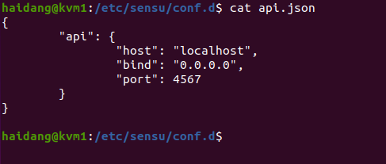
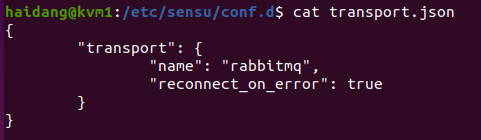
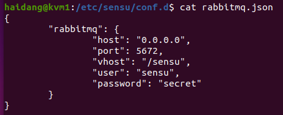
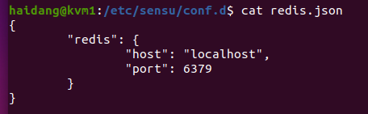
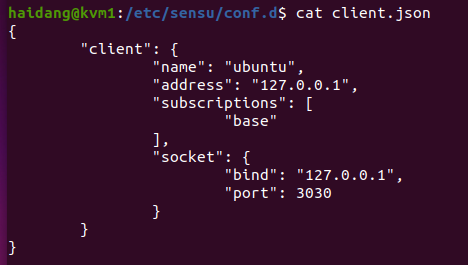
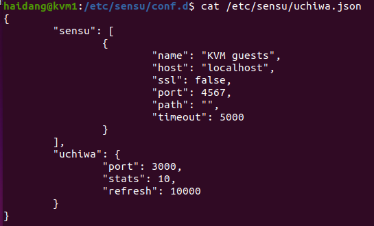
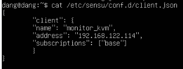
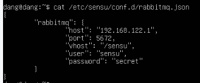
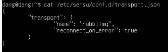
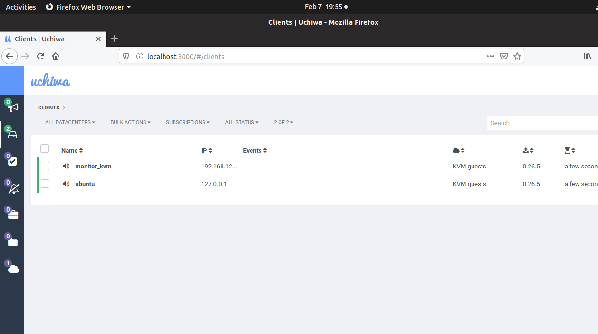

# I. Xem tài nguyên sử dụng

## Xem thông tin máy ảo
```
root@kvm:~# virsh dominfo kvm1  
Id: 30  
Name: kvm1  
UUID: bd167199-c1c4-de7e-4996-43a7f197e565  
OS Type: hvm  
State: running  
CPU(s): 1  
CPU time: 175.6s  
Max memory: 1048576 KiB  
Used memory: 1048576 KiB  
Persistent: yes  
Autostart: disable  
Managed save: no  
Security model: none  
Security DOI: 0
```  

## Xem CPU
### Xem thông số CPU
```
root@kvm:~# virsh nodecpustats --percent  
usage: 0.0%  
user: 0.0%  
system: 0.0%  
idle: 100.0%  
iowait: 0.0%
```  

### Xem số virtual CPU cấp cho VM
```
root@kvm:~# virsh vcpucount --current kvm1 --live  
1
```  

### Xem thông tin chi tiết về virtual CPU
```
root@kvm:~# virsh vcpuinfo kvm1  
VCPU: 0  
CPU: 29  
State: running  
CPU time: 118.8s  
CPU Affinity: yyyyyyyyyyyyyyyyyyyyyyyyyyyyyyyyyyyyyyyy
```  

### Xem thông tin về thời gian vCPU
```
root@kvm:~# virsh cpu-stats --total kvm1  
Total:  
cpu_time 175.003045493 seconds  
user_time 2.610000000 seconds  
system_time 7.510000000 seconds
```  

## Xem thông tin Memory
### Thu thập thông tin sử dụng memory hypervisor
```
root@kvm:~# virsh nodememstats  
total : 131918328 KiB  
free : 103633700 KiB  
buffers: 195532 KiB  
cached : 25874840 KiB
```  

### Xem memory của VM
```
root@kvm:~# virsh dommemstat --live kvm1  
actual 1048576  
swap_in 0  
rss 252684
```  

## Xem thông tin Block device
### Xem các block device gắn vào KVM
```
root@kvm:~# virsh domblklist kvm1  
Target Source  
------------------------------------------------  
hda /var/lib/libvirt/images/kvm1.img
```  

### Xem kích thước của block device
```
root@kvm:~# virsh domblkinfo --device hda kvm1  
Capacity: 8589934592  
Allocation: 2012381184  
Physical: 2012381184
```  

### Xem lỗi trên block device
```
root@kvm:~# virsh domblkerror kvm1  
No errors found
```  

### Xem trạng thái của block device trên VM
```
root@kvm:~# virsh domblkstat --device hda --human kvm1  
Device: hda  
number of read operations: 42053  
number of bytes read: 106145280  
number of write operations: 10648  
number of bytes written: 96768000  
number of flush operations: 4044  
total duration of reads (ns): 833974071  
total duration of writes (ns): 1180545967  
total duration of flushes (ns): 3458623200
```  

# II. Monitoring KVM instances with Sensu
Sensu là một giải phải giám sát dùng mô hình client-server; server sẽ check message queue cung cấp bởi rabbitmq
Client (agent) sẽ đăng ký vào queue và thực hiện check trên host chúng đang chạy. Trạng thái và lịch sử data sẽ được lưu và redis server.
Có thể xem thêm về redis server tại đây: [https://medium.com/vunamhung/redis-l%C3%A0-g%C3%AC-t%C3%ACm-hi%E1%BB%83u-v%E1%BB%81-c%C6%A1-s%E1%BB%9F-d%E1%BB%AF-li%E1%BB%87u-redis-60dd267f53ad](https://medium.com/vunamhung/redis-l%C3%A0-g%C3%AC-t%C3%ACm-hi%E1%BB%83u-v%E1%BB%81-c%C6%A1-s%E1%BB%9F-d%E1%BB%AF-li%E1%BB%87u-redis-60dd267f53ad)

## Cách cài đặt ở sensu server
1. Cài redis server và kiểm tra
```
root@kvm:~# apt-get install -y redis-server  
...  
root@kvm:~# redis-cli ping  
PONG
```  

2. Cài Rabbitmq server
```
root@kvm:~# apt-get install -y rabbitmq-server
```  
3.  tạo virtual host mà sensu agent sẽ đăng ký tới và chứng chỉ + quyền cho rabbitmq client:
```
root@kvm:~# rabbitmqctl add_vhost /sensu  
Creating vhost "/sensu" ...  
...done.  
root@kvm:~# rabbitmqctl add_user sensu secret  
Creating user "sensu" ...  
...done.  
root@kvm:~# rabbitmqctl set_permissions -p /sensu sensu ".*" ".*" ".*"  
Setting permissions for user "sensu" in vhost "/sensu" ...  
...done.
```  
4. Cài sensu
```
root@kvm:~# wget -q https://sensu.global.ssl.fastly.net/apt/pubkey.gpg -  
O- | apt-key add -  
OK  
root@kvm:~# echo "deb https://sensu.global.ssl.fastly.net/apt sensu  
main" | tee /etc/apt/sources.list.d/sensu.list  
deb https://sensu.global.ssl.fastly.net/apt sensu main  
root@kvm:~# apt-get update  
...  
root@kvm:~# apt-get install -y sensu
```  

5. Tạo file /etc/sensu/conf.d/api.json
  

6.  Tạo file /etc/sensu/conf.d/transport.json
  

7. Tạo file /etc/sensu/conf.d/rabbitmq.json
  

8. Tạo file /etc/sensu/conf.d/redis.json
  

9. Tạo file /etc/sensu/conf.d/client.json
   
 
 10. Cài uchiwa (web frontend cho sensu)
```
root@kvm:# apt-get install -y uchiwa
```  

11. config uchiwa
   
 
 12. Khởi động sensu 
 ```
 root@kvm:/etc/sensu/conf.d# /etc/init.d/sensu-server start  
* Starting sensu-server [ OK ]  
root@kvm:/etc/sensu/conf.d# /etc/init.d/sensu-api start  
* Starting sensu-api [ OK ]  
root@kvm:/etc/sensu/conf.d# /etc/init.d/sensu-client start  
* Starting sensu-client [ OK ]  
root@kvm:/etc/sensu/conf.d# /etc/init.d/uchiwa restart  
uchiwa started.
```  

## Cách cài đặt ở sensu agent
1. Cài sensu agent
```
root@debian:~# wget -q  
https://sensu.global.ssl.fastly.net/apt/pubkey.gpg -O- | apt-key add -  
OK  
root@debian:~# echo "deb https://sensu.global.ssl.fastly.net/apt sensu  
main" | tee /etc/apt/sources.list.d/sensu.list  
deb https://sensu.global.ssl.fastly.net/apt sensu main  
root@debian:~# apt install apt-transport-https  
root@debian:~# apt update && apt install sensu
```  

2. Tạo file /etc/sensu/conf.d/client.json
   
 
 *NOTE: LƯU Ý ĐỊA CHỈ IP LÀ IP CÚA MÁY ẢO (GUEST)  
 
 3. Tạo file /etc/sensu/conf.d/rabbitmq.json
   
* NOTE: LƯU Ý ĐỊA CHỈ IP LÀ CỦA MÁY HOST  

4. Tạo file /etc/sensu/conf.d/transport.json
  

5. Khởi động dịch vụ
```
root@debian:/etc/sensu/conf.d# /etc/init.d/sensu-client start  
Starting sensu-client:.
```  

## Dùng uchiwa để giám sát các máy ảo
Ở host OS, chúng ta vào trình duyệt web để truy cập vào uchiwa
  
